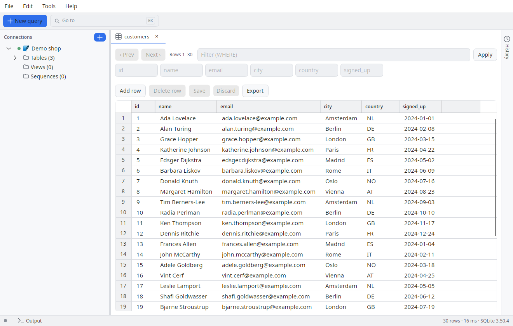
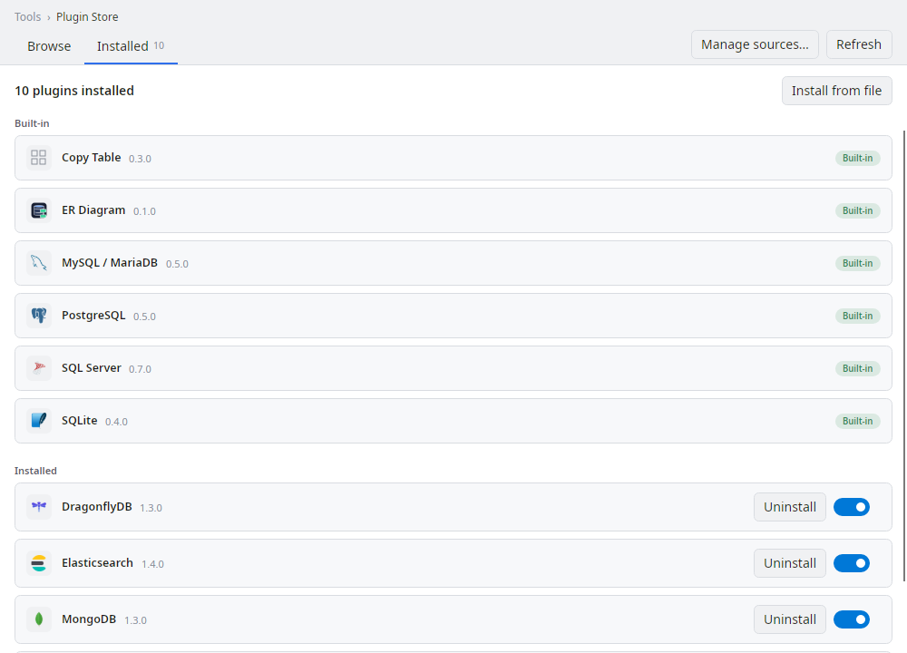

# DataTray

A cross-platform, multilingual SQL explorer built in .NET. Database drivers ship
as plugins, result sets are editable with a reviewable save flow, and connections
are managed with OS-keychain credential storage.

Desktop (Windows / Linux / macOS) is the current focus; mobile heads
(Android / iOS / iPadOS) are intentionally parked.

## Screenshots

Browsing a table with the editable result grid — all data shown is synthetic:



Every database engine ships as a plugin; the Plugin Store manages them:



> Screenshots are rendered headlessly from the real app (no display, no real database) by
> [`DataTray.Screenshots`](src/DataTray.Screenshots) — regenerate with `tools/screenshots.sh`.

## Project layout

| Project | Role |
|---------|------|
| `src/DataTray.Sdk` | **Public contract**: `IDbProvider`, `ISqlDialect`, `ISqlFormatter`, schema/query DTOs. Interfaces and DTOs only — no host internals. This is the only assembly external plugins reference. **MIT-licensed** (see below). |
| `src/DataTray.Core` | Host domain: formatter baseline, i18n seam, provider registry, edit models, sessions. No UI, no driver dependencies. References `DataTray.Sdk`. |
| `src/DataTray.Infrastructure` | Host plumbing: persistence, secret stores, plugin extensibility, the Plugin Store client and the app/plugin updaters. |
| `src/DataTray.Providers.*` | Bundled `IDbProvider` plugins: PostgreSQL (Npgsql), SQLite, MySQL/MariaDB, SQL Server. **They reference only `DataTray.Sdk`** — proof that a provider builds independently of the host. |
| `src/DataTray.Tools.MsSqlAdmin` | Bundled tool plugin: the SQL Server admin dialogs. |
| `src/DataTray.Mcp.Hosting` | Host-side MCP server and the seam that exposes plugin-contributed tools to an AI client. |
| `src/DataTray.Mcp.Server` | Bundled first-party MCP tools plugin (`datatray-mcp`). |
| `src/DataTray.App` | Avalonia UI (MVVM, CommunityToolkit.Mvvm): views, view models, resx localization, DI. Platform-agnostic. |
| `src/DataTray.Desktop` | Desktop head (Windows / Linux / macOS) — the runnable project. |
| `src/DataTray.Screenshots` | Headless renderer for the README screenshots. |
| `plugins/` | Store-only plugins, installed from the Plugin Store rather than bundled: ClickHouse, DuckDB, MongoDB, Redis, DragonflyDB, Elasticsearch, the Local Containers (Docker) backend, the Schema Diff / Copy Table / Generate Scripts / ER Diagram / Universal Backup / BACPAC tools, and a provider template. |

A new database = a new provider plugin that references only `DataTray.Sdk`.
No UI change, no Core dependency — see [`docs/PLUGINS.md`](docs/PLUGINS.md).

## Build & run (desktop)

```bash
dotnet build
dotnet run --project src/DataTray.Desktop
```

A Debug build also stages the `plugins/` tree, so the store-only plugins are
present while developing; a Release build ships only the bundled ones.

## Features

**Everything is a plugin**

- **Providers as ALC plugins**, loaded from `plugins/<id>/` — the host binaries
  carry no driver dependencies. Bundled: PostgreSQL, SQLite, MySQL/MariaDB,
  SQL Server. From the **Plugin Store**: ClickHouse, DuckDB, MongoDB, Redis,
  DragonflyDB, Elasticsearch.
- **Plugin Store** with an Updates section, proactive update notifications and
  staged updates that apply on restart. Tool and panel plugins extend the UI
  (own dialogs, own toggle icons) through the same seam.
- **Store-only tools**: Schema Diff, Copy Table (across connections), Generate
  Scripts, ER Diagram, Universal Backup & Restore, SQL Server BACPAC/DACPAC.
  A tool plugin can open as a dialog or as its own tab beside your queries.
- **Local Containers (Docker)**: start a local database container from a
  provider-declared recipe and get a connection for it.

**Working with data**

- Connect and browse a **lazy schema tree** (server → database → schema →
  tables/views → columns, DBeaver-style).
- **Tabs**: multiple query and browse panes open at once; the session restores
  the tabs you left on.
- **Query tab**: SQL pane (AvaloniaEdit, syntax highlighting) with scope-aware
  completion, formatting options, paged results, and open/save as `.sql`.
- **Browse tab** (double-click a table): page through rows without writing SQL —
  paging (previous/next), a WHERE filter and column-header sort (server-side
  ORDER BY). Editable, with the same save flow.
- **Editable result set + save flow**: edit cells, add or delete rows; Save shows
  the generated INSERT/UPDATE/DELETE for review and runs them in a single
  transaction. Enabled only when the result traces back to a single table with a
  primary key (otherwise read-only, with the reason shown). Cell editors follow
  the column's type; a cell value opens in its own window on double-click.
- **Query history and logging**, starred queries and starred connections.

**Around it**

- Connection management with **secure credential storage** (OS keychain via
  `ISecretStore`), plus import/export.
- **SSH tunnelling** to reach a database behind a bastion: host-side, so every
  provider gets it without knowing about it. Optional host-key pinning.
- **MCP server** owned by the host: an AI client can query, browse and create
  connections, per-connection AI access is opt-in, and an AI-activity panel shows
  what it did.
- **In-app updater** with release channels, a Restart-app command, an
  About/diagnostics dialog, and configurable keyboard shortcuts.
- **Runtime language switch** NL ⇄ EN (resx + `ILocalizer`).

## Not yet (roadmap)

- **Mobile heads** (Android / iOS / iPadOS): separate head projects requiring
  `dotnet workload install android` / `ios` plus a macOS runner for iOS signing.
- **Per-dialect SQL formatting** beyond SQL Server: the `ISqlFormatter` seam is
  there, but other providers still fall back to the generic baseline.

## Conventions

C#: file-scoped namespaces, nullable enabled, Allman braces, primary
constructors, `Async` suffix, `ct` as the last parameter.

## Contributing

Contributions are welcome, but the bar is high for a one-person project. **Read
[`CONTRIBUTING.md`](CONTRIBUTING.md) before opening a pull request** — it covers the PR policy,
coding conventions, the plugin boundary for adding a database, commit style and the changelog flow.

- **Bugs or feature requests:** [open an issue](https://github.com/Lionear/DataTray/issues).
- **Adding a database or tool:** it's a plugin, not a host change — see [`docs/PLUGINS.md`](docs/PLUGINS.md).
- **What changed between releases:** [`CHANGELOG.md`](CHANGELOG.md).

By participating you agree to the [Code of Conduct](CODE_OF_CONDUCT.md).

## License

This project is **source-available**, split across two licenses:

- **`src/DataTray.Sdk`** — [MIT](src/DataTray.Sdk/LICENSE). The public plugin
  contract is permissively licensed so anyone can build and distribute their own
  database providers freely.
- **Everything else** (App, Core, Infrastructure, Desktop, Providers.*) —
  [Apache-2.0 with the Commons Clause](LICENSE). You may use, modify, and share
  it freely, **including for internal business use**. You may **not sell** it —
  the Commons Clause removes the right to sell the software or to offer a paid
  product or service (including paid hosting or support) whose value derives
  substantially from it. To sell or redistribute commercially, contact
  rick@bonkestoter.com for a separate license.

The bundled open-source dependencies keep their own licenses; the attribution
they require lives in [THIRD-PARTY-NOTICES.md](THIRD-PARTY-NOTICES.md), which
ships alongside the binaries. It is generated from the NuGet dependency closure
by `tools/generate-third-party-notices.py` — re-run that after changing
dependencies (`--check` verifies the committed file is current).
